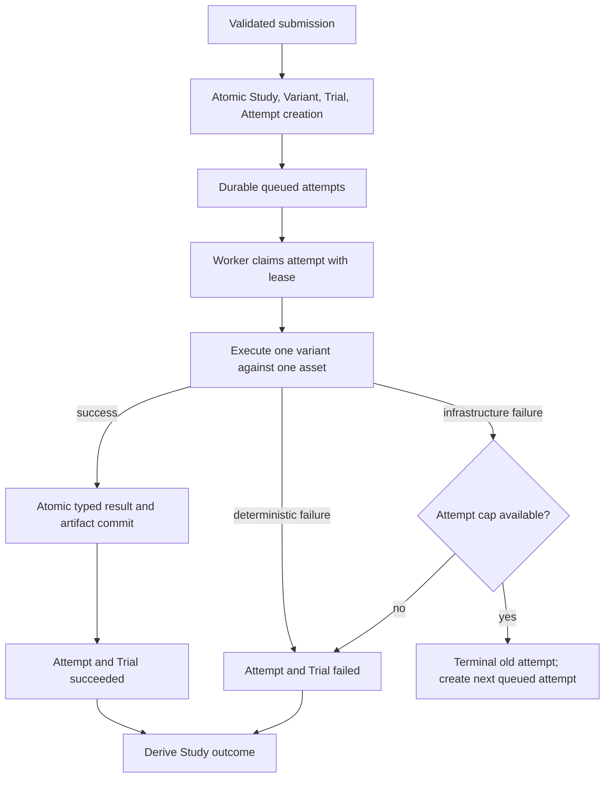

# MON-133 BT Persistence V2

## Engineering Call
- Use the concise `Bt` namespace consistently—never the redundant `BtBacktest` prefix.
- Build a new canonical hierarchy: `BtStudy` → `BtVariant` → `BtTrial` → `BtTrialAttempt` → `BtTrialResult`.
- Treat “single,” “batch,” and “grid” as submission shapes only:
  - single = 1 study × 1 variant × 1 trial
  - batch = 1 study × 1 variant × N trials
  - grid = 1 study × C variants × N trials
- Keep existing single/batch HTTP and MCP wrappers. Their external `run_id` is exactly the new `study_id`; no permanent translation table.
- Make V2 canonical for all new work. Drop legacy saved backtest, artifact, and dependent saved research data at cutover; do not backfill or dual-write.

## Proof Path
- This unlocks durable cartesian grids without nested “batch leaf runs.”
- One scheduler and lifecycle handles every execution shape, so MON-132 becomes orchestration over variants and trials rather than another persistence type.
- The clean cutover is justified because existing saved data is explicitly disposable; preserving public wrappers limits unrelated frontend/MCP churn.

## System Surfaces
- Schema and migration: [`backend/app/models.py`](/Users/destinguarnieri/Desktop/codebase/mm_v04/backend/app/models.py), [`backend/app/alembic/versions/`](/Users/destinguarnieri/Desktop/codebase/mm_v04/backend/app/alembic/versions/)
- Execution and lifecycle: [`backend/app/services/backtest/backtest_manager.py`](/Users/destinguarnieri/Desktop/codebase/mm_v04/backend/app/services/backtest/backtest_manager.py), [`backend/app/services/backtest/backtest_persistence_service.py`](/Users/destinguarnieri/Desktop/codebase/mm_v04/backend/app/services/backtest/backtest_persistence_service.py), [`backend/app/services/backtest/async_backtest_backend.py`](/Users/destinguarnieri/Desktop/codebase/mm_v04/backend/app/services/backtest/async_backtest_backend.py)
- API/read compatibility: [`backend/app/api/routes/backtest.py`](/Users/destinguarnieri/Desktop/codebase/mm_v04/backend/app/api/routes/backtest.py), [`backend/app/data_models/dto/backtest.py`](/Users/destinguarnieri/Desktop/codebase/mm_v04/backend/app/data_models/dto/backtest.py), [`backend/app/helpers/backtest.py`](/Users/destinguarnieri/Desktop/codebase/mm_v04/backend/app/helpers/backtest.py), [`backend/app/crud.py`](/Users/destinguarnieri/Desktop/codebase/mm_v04/backend/app/crud.py)
- Research and artifacts: [`backend/app/services/research/`](/Users/destinguarnieri/Desktop/codebase/mm_v04/backend/app/services/research/), [`research_mcp/research_mcp/`](/Users/destinguarnieri/Desktop/codebase/mm_v04/research_mcp/research_mcp/)
- Frontend compatibility: [`frontend/src/routes/_layout/backtest.tsx`](/Users/destinguarnieri/Desktop/codebase/mm_v04/frontend/src/routes/_layout/backtest.tsx)

## Core Invariants
- Study identity: UUID allocated after request validation and returned externally as `run_id`.
- Variant identity: unique `(study_id, variant_key)` plus unique `(study_id, variant_index)`. `variant_key` hashes canonicalized complete non-asset execution input: strategy implementation/version snapshot, params, config, trade config, capital, fees, and slippage.
- Duplicate normalized variants are rejected before acceptance. Repeated stochastic evaluations require a future explicit replicate feature.
- Trial identity: unique `(variant_id, asset_id)`. Trial owns typed asset settings such as leverage, max-position percent, and margin mode.
- Attempt identity: unique `(trial_id, attempt_number)`. Attempts are immutable after reaching a terminal state.
- Automatic retries create new attempts, never overwrite prior attempts. V1 uses a system-configured cap of two total attempts and retries only interruption/transient infrastructure failures.
- Every accepted execution persists Study/Variant/Trial/initial Attempt rows atomically before work starts. Validation failures create nothing.
- Every successful attempt retains typed metrics and diagnostics. Artifact retention is either `metrics` or `full`; `lite` maps to metrics-only and `compact/full` map to full artifacts. Legacy `auto_save` remains accepted as a deprecated no-op because all accepted runs are durable.
- Attempt results and artifacts commit atomically before the attempt can become `succeeded`.
- Attempt statuses: `queued`, `running`, `succeeded`, `failed`, `interrupted`, `canceled`.
- Trial statuses: `queued`, `running`, `succeeded`, `failed`, `canceled`.
- Study terminal statuses: `succeeded`, `partially_succeeded`, `failed`, `canceled`; partial success is explicit.
- Variant outcomes and all requested/success/failed counts are derived from trials, not duplicated as authoritative columns.
- Cross-asset aggregates are computed from successful typed results on read. No aggregate persistence table is introduced without measured need.
- Process recovery marks stale leased attempts `interrupted`, then creates a new queued attempt when the retry policy permits. Queued work remains recoverable from the database.
- Hierarchy and artifact FKs cascade on physical Study deletion. Asset references are restricted; mutable strategy/backtest-strategy references may become null because immutable snapshots live on Variant.

## Implementation Shape
- Proposed tables:
  - `bt_study`: owner, shared strategy/request snapshot, interval/range, retention policy, lifecycle, timestamps; `id` is public `run_id`.
  - `bt_variant`: immutable complete non-asset config, canonical hash, deterministic index.
  - `bt_trial`: one asset evaluation intent, typed asset settings, lifecycle.
  - `bt_trial_attempt`: attempt number, lease/worker fields, failure classification, timestamps.
  - `bt_trial_result`: one typed, schema-versioned metrics row keyed by successful `attempt_id`.
  - Trial-attempt artifact tables keyed only by `attempt_id`, with `(attempt_id, timestamp)` indexes and attempt-scoped uniqueness where applicable.
  - Recreated research root keyed canonically by `study_id`, exposing it as `run_id` through existing DTOs.
- Use PostgreSQL JSONB for immutable request/config snapshots, but keep frequently queried metrics as typed result columns.
- Replace the in-memory batch queue as source of truth with database-backed queued attempts. Workers claim rows transactionally using row locking, set a lease, and recover stale leases after restart.
- Keep `POST /run` synchronous by submitting the same durable model and awaiting its terminal trial; keep `POST /run/batch` as a 202 convenience wrapper. Polling and saved retrieval query durable Study/Trial state rather than process memory.
- Existing saved-run/detail/hydration DTOs are compatibility projections from V2. `run_type` is derived for one-variant wrapper calls; it is not stored as a persistence discriminator.

## Exact Schema Contract
- Use UUID primary keys generated by the application, `TIMESTAMPTZ` lifecycle timestamps, `BIGINT` epoch milliseconds only for market-data ranges/events, PostgreSQL `JSONB` for immutable snapshots, and `VARCHAR` plus named `CHECK` constraints for lifecycle/failure values. Do not introduce PostgreSQL native enums.
- `BtStudy` / `bt_study`:
  - `id UUID PK`; this is the externally returned `run_id`.
  - `user_id UUID NULL FK user.id ON DELETE SET NULL`, indexed.
  - Nullable navigational `strategy_id` / `backtest_strategy_id` FKs use `ON DELETE SET NULL`.
  - Separate immutable non-FK snapshot identity: required `strategy_id_snapshot`, `strategy_name_snapshot`, and nullable `backtest_strategy_id_snapshot`, `backtest_strategy_group_id_snapshot`, `backtest_strategy_version_snapshot`. Canonical hashing uses only snapshot fields.
  - Named checks require each non-null navigational strategy FK to equal its immutable snapshot; null navigation remains legal after source deletion.
  - Shared data contract: exactly one `interval`, `min_candles`, paired nullable `start_ms`/`end_ms`, with a check requiring both null or `0 <= start_ms < end_ms`.
  - `request_json JSONB NOT NULL` preserves the validated submission/grid specification.
  - `retention_mode VARCHAR NOT NULL CHECK IN ('metrics', 'full')`.
  - `status VARCHAR NOT NULL CHECK IN ('queued', 'running', 'succeeded', 'partially_succeeded', 'failed', 'canceled')`.
  - `submitted_at`, nullable `started_at`/`finished_at`, `created_at`, `updated_at`.
  - Indexes: `(user_id, submitted_at DESC)`, `(status, submitted_at)`, and `(strategy_name, submitted_at DESC)`.
- `BtVariant` / `bt_variant`:
  - `id UUID PK`, `study_id UUID NOT NULL FK bt_study.id ON DELETE CASCADE`.
  - `variant_index INT NOT NULL CHECK variant_index >= 0`.
  - `variant_key VARCHAR(64) NOT NULL` with a named `^[0-9a-f]{64}$` PostgreSQL check; `variant_key_version SMALLINT NOT NULL DEFAULT 1`.
  - Immutable `params_json`, `config_json`, `trade_config_json` as non-null JSONB with named checks requiring each value to be a JSON object.
  - `initial_capital`, `fees`, and `slippage` as `NUMERIC(38,18)` with named checks explicitly excluding PostgreSQL `NaN`, `Infinity`, and `-Infinity`; capital is strictly positive and costs are non-negative.
  - `created_at`.
  - Unique `(study_id, variant_index)` and `(study_id, variant_key)`; index `study_id`.
- `BtTrial` / `bt_trial`:
  - `id UUID PK`, `variant_id UUID NOT NULL FK bt_variant.id ON DELETE CASCADE`.
  - `asset_id UUID NOT NULL FK hyperliquidasset.id ON DELETE RESTRICT` and immutable `symbol` snapshot.
  - Typed asset inputs: `leverage SMALLINT`, `max_position_percent NUMERIC(38,18)`, `is_cross_margin BOOLEAN`, with the same bounds as the validated API model; max-position checks explicitly exclude PostgreSQL special numeric values.
  - `status VARCHAR NOT NULL CHECK IN ('queued', 'running', 'succeeded', 'failed', 'canceled')`.
  - `created_at`, `updated_at`.
  - Unique `(variant_id, asset_id)`; indexes `(variant_id, status)` and `(status, updated_at)`.
- `BtTrialAttempt` / `bt_trial_attempt`:
  - `id UUID PK`, `trial_id UUID NOT NULL FK bt_trial.id ON DELETE CASCADE`.
  - `attempt_number SMALLINT NOT NULL CHECK attempt_number >= 1`.
  - `status VARCHAR NOT NULL CHECK IN ('queued', 'running', 'succeeded', 'failed', 'interrupted', 'canceled')`.
  - Nullable failure fields: `failure_kind CHECK IN ('data', 'strategy', 'infrastructure', 'interrupted', 'canceled')`, stable `error_code`, human `error_message`, and `error_details_json JSONB`.
  - Claim/lease fields: nullable `worker_id`, `lease_expires_at`, `heartbeat_at`.
  - `queued_at`, nullable `started_at`/`finished_at`, `created_at`.
  - Unique `(trial_id, attempt_number)`, index `(status, queued_at)`, index `(status, lease_expires_at)`, and a partial unique index permitting at most one `succeeded` attempt per Trial.
- `BtTrialResult` / `bt_trial_result`:
  - `attempt_id UUID PK FK bt_trial_attempt.id ON DELETE CASCADE`.
  - `metrics_schema_version SMALLINT NOT NULL`.
  - Preserve the current strongly typed scalar metric set rather than moving it into generic JSON or name/value rows.
  - Keep structured diagnostics such as candle-load provenance in versioned JSONB.
  - `created_at`; a result row is legal only for an Attempt transitioning to `succeeded`.
- Attempt-owned artifact tables:
  - Use `BtAttemptOrderEvent` / `bt_attempt_order_event`, `BtAttemptFill` / `bt_attempt_fill`, `BtAttemptPositionEvent` / `bt_attempt_position_event`, `BtAttemptIndicatorValue` / `bt_attempt_indicator_value`, `BtAttemptSignalValue` / `bt_attempt_signal_value`, and `BtAttemptPnlPoint` / `bt_attempt_pnl_point`.
  - Every artifact has `attempt_id UUID NOT NULL FK bt_trial_attempt.id ON DELETE CASCADE`.
  - Remove ownership columns `run_id` and `asset_id`; Trial supplies asset identity.
  - Lead retrieval indexes with `(attempt_id, event_timestamp)`.
  - Fill uniqueness becomes `(attempt_id, account_address, tid)`. Other source identities remain attempt-scoped; retries cannot collide because each retry has a new Attempt.
- Recreate `BtResearchRun` with canonical `study_id UUID NOT NULL FK bt_study.id ON DELETE CASCADE`; existing public DTOs continue exposing this as `run_id`. Recreate dependent signal-deciles rows under the new research root.

## Canonical Variant Identity
- Build a versioned canonical payload from the Study strategy snapshot plus Variant params, config, trade config, capital, fees, and slippage.
- Exclude nullable navigational source FKs from the payload; source deletion must not change immutable identity.
- Canonicalization rules:
  - sort object keys recursively;
  - preserve list order;
  - encode UUIDs/enums as their stable string values;
  - normalize the typed top-level Decimal capital/cost fields to non-exponent decimal strings;
  - preserve validated JSON scalar types inside params/config/trade config;
  - reject NaN, infinity, unsupported objects, and non-string object keys before Study creation;
  - encode compact UTF-8 JSON and compute lowercase SHA-256.
- Store both `variant_key` and `variant_key_version`. Never change canonicalization behavior without incrementing the version.
- Duplicate `(study_id, variant_key)` is a validation error, not silent deduplication.

## Exact Lifecycle Contract
- Submission:
  1. Validate the complete request, asset settings, bounds, canonical variants, and duplicates without writing.
  2. In one transaction insert Study, all Variants, all Trials, and Attempt 1 for every Trial.
  3. Only after commit may the API return the Study UUID or workers claim work.
- Claim:
  - Workers select queued attempts in deterministic `(queued_at, id)` order with row locking and `SKIP LOCKED`.
  - Claim atomically changes Attempt and Trial to `running`, sets worker/lease fields, and moves Study from `queued` to `running`.
  - Heartbeats extend leases; process memory is never the authoritative queue or status store.
- Success:
  - One transaction inserts the typed result and requested artifacts, marks Attempt/Trial `succeeded`, and rolls up Study status.
  - No caller can observe `succeeded` before all retained output commits.
- Deterministic failure:
  - `data` and `strategy` failures mark Attempt and Trial `failed` without automatic retry.
- Infrastructure failure:
  - Mark the current Attempt `failed` with `failure_kind='infrastructure'`.
  - If fewer than the configured maximum two attempts exist, create the next queued Attempt and return Trial to `queued`; otherwise mark Trial `failed`.
- Crash recovery:
  - A recovery pass locks expired `running` Attempts, marks them immutable `interrupted`, and creates the next queued Attempt within the cap; exhausted Trials become `failed`.
  - Never resume or rewrite an interrupted Attempt.
- Cancellation:
  - Queued work may transition directly to `canceled`.
  - Running work becomes `canceled` only after cooperative worker acknowledgement; cancellation is not retried.
  - Cancellation API/UI is not required in the first foundation slice, but the state contract must not require a future migration.
- Study rollup:
  - `queued`: no Trial has started.
  - `running`: at least one Trial is non-terminal after work has started.
  - `succeeded`: every Trial succeeded.
  - `partially_succeeded`: at least one Trial succeeded and at least one Trial failed or was canceled.
  - `failed`: every non-canceled Trial failed and none succeeded.
  - `canceled`: no Trial succeeded and all Trials were canceled.
  - Requested/succeeded/failed/canceled counts are query-derived from Trials.

## Failure and Atomicity Contract
- Pre-acceptance validation failure: no Study or child rows.
- Failure while creating the hierarchy: the entire acceptance transaction rolls back.
- Failure while writing a result/artifact set: the entire completion transaction rolls back; the Attempt remains non-successful and is recovered through lease expiry/retry.
- Partial Trial failure never rolls back successful sibling Trials.
- Per-submission bounds are validated before acceptance. A configurable global pending-attempt cap is enforced transactionally; exceeding it returns 503 and writes nothing. Once committed, queued work remains durable until claimed; silent job loss is forbidden.
- `auto_save` no longer controls durability. Compatibility wrappers accept it but every accepted execution stores control rows and typed metrics.
- There is no separate `writing`/`saved` lifecycle. Durable output commit and the `succeeded` transition are one transaction.

## Clean Cutover Contract
- Build V2 additively while legacy routes continue operating during development, but do not dual-write executions.
- At the single cutover:
  - route all single/batch execution, status, saved retrieval, hydration, and signal-deciles reads to V2;
  - drop legacy `bt_backtest_run`, `bt_backtest_run_asset`, `bt_backtest_batch_aggregate`, legacy run-owned artifact tables, and affected saved research-result tables;
  - recreate attempt-owned artifacts and Study-owned research tables;
  - delete legacy persistence service/backend, aggregate persistence, legacy CRUD/builders, and in-memory batch status as source of truth.
- No backfill, fallback reader, compatibility mapping table, or retained legacy internal model remains.
- Existing API wrappers remain contract-compatible: `run_id == BtStudy.id`; single/batch `run_type` is derived for one-Variant wrapper submissions; `(run_id, asset_id)` hydration resolves Study → sole Variant → Trial → successful Attempt.
- The migration must state plainly that existing saved backtests, artifacts, and saved signal-deciles research are intentionally destroyed.

## Launch-Reviewable Slices
1. **Add BT Study/Variant/Trial/Attempt foundation**
   - Additive control-plane models, migration, canonical identity helper, and constraint tests only.
   - Primary files: `backend/app/models.py`, one Alembic revision, new `backend/app/services/backtest/identity.py`, new foundation test file.
   - Exact brief: `wiki/engineering/MON-133-bt-foundation-slice-brief.md`.
2. **MON-135 — Add typed Trial results and attempt-owned artifacts**
   - Complete metric DDL, artifact DDL/uniqueness, and atomic output persistence.
   - Must not schedule work or change public API reads.
   - Exact brief: `wiki/engineering/MON-133-bt-results-artifacts-brief.md`.
3. **MON-136 — Add durable BT attempt scheduling and recovery**
   - Database claims, leases, heartbeats, transition guards, failure taxonomy mapping, retries, pending bounds, and restart recovery.
   - Owns manager/persistence orchestration; depends on slices 1–2.
   - Exact brief: `wiki/engineering/MON-133-bt-durable-scheduler-brief.md`.
4. **MON-137 — Project BT V2 through existing API/MCP/frontend contracts**
   - Exact list/detail/status/hydration projections and `run_id == study_id` compatibility.
   - No legacy fallback/dual-read, saved research migration, or legacy deletion.
   - Exact brief: `wiki/engineering/MON-133-bt-compatibility-brief.md`.
5. **MON-138 — Migrate saved BT research to Study/Trial ownership**
   - Recreate research roots/FKs and signal-deciles artifact resolution against successful Attempts.
   - Exact brief: `wiki/engineering/MON-133-bt-research-migration-brief.md`.
6. **MON-139 — Remove legacy BT persistence and data**
   - Destructive final cutover after slices 1–5 are accepted.
   - Drop legacy tables/data and delete legacy services, CRUD/builders, aggregate persistence, and fallback paths.
   - Exact brief: `wiki/engineering/MON-133-bt-legacy-removal-brief.md`.
7. **Rewrite MON-132 grid orchestration**
   - Bounded Variant expansion over the accepted V2 foundation.

## Dependency Order
1. Create the foundation child ticket from its exact brief and run coding-manager launch review.
2. After foundation acceptance, launch the typed result/artifact schema ticket.
3. After result/artifact acceptance, launch durable scheduling/lifecycle.
4. After execution acceptance, launch API/MCP/frontend compatibility projection.
5. After compatibility acceptance, launch saved research migration.
6. After all replacement readers/writers are accepted, launch destructive legacy deletion.
7. Rewrite MON-132 only after the V2 cutover is complete.

## Engineering Acceptance Checks
- Migration tests prove clean upgrade from the current schema and explicitly document destructive saved-data loss.
- Duplicate variants, duplicate trial identities, invalid asset settings, and over-bound submissions fail before any Study row is committed.
- Database tests reject non-object Variant JSON and all special NUMERIC values (`NaN`, `Infinity`, `-Infinity`).
- Source deletion may null navigational strategy FKs but cannot alter immutable snapshot columns or Variant identity.
- Database tests reject navigational strategy/snapshot disagreement and malformed, uppercase, short, or non-hex Variant keys.
- Queue admission, worker crash, stale lease, infrastructure retry, deterministic failure, retry exhaustion, cancellation, and partial-study outcomes have focused negative-path tests.
- A simulated failure while writing results/artifacts leaves no successful Attempt with partial output.
- Restart tests prove queued attempts survive and running attempts become immutable `interrupted` attempts followed by a new attempt within the cap.
- Derived aggregate output matches current batch aggregate DTO semantics for equivalent trial fixtures.
- Existing single/batch route, frontend, and Research MCP contract tests pass with `run_id == study_id`.
- Signal-deciles reads attempt-owned signal/PnL artifacts through Study/Trial resolution.
- No runtime references remain to `BtBacktestRun`, `BtBacktestRunAsset`, `BtBacktestBatchAggregate`, legacy artifact `(run_id, asset_id)` ownership, or in-memory batch status as source of truth.

## Handoff Decision
- MON-133 remains the architecture parent and must not be handed to a worker.
- The additive foundation child has a separate narrow brief and is the only slice eligible for the next coding-manager launch review.
- Do not draft or send a worker kickoff until that child ticket exists and its launch review returns `Ready`.