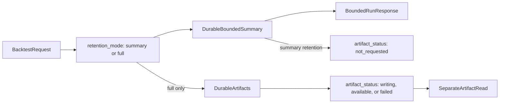

# Backtest Retention Contract Rollout

## Contract

Use one request choice and one persisted outcome:

- `retention_mode: "summary" | "full"` controls whether optional heavy artifacts are retained.
- `artifact_status: "not_requested" | "writing" | "available" | "failed"` records what happened; it is never a request option.

Every accepted run durably saves its identity, immutable inputs and provenance, candle diagnostics, outcome, aggregate metrics, trade ledger, and bounded chart series. `full` additionally retains the bar-level artifact families. Run endpoints always return a bounded summary; full artifacts are read separately after they become available.

Normal research screening uses `retention_mode="summary"`. A promoted audit run uses `retention_mode="full"`.

## Scope boundary

This slice establishes semantics and routes current behavior through them. It does not add Parquet, V2 execution, streaming aggregation, new scheduling, or a timeout increase.

## Rollout

### 1. Canonical retention contract and compatibility resolver

Add strongly typed enums plus one immutable internal contract in a focused module such as [`backend/app/services/backtest/retention_policy.py`](backend/app/services/backtest/retention_policy.py).

- New requests accept only `retention_mode`.
- During one compatibility window, legacy `detail_mode` and `auto_save` remain optional.
- Reject requests that mix new and legacy fields.
- Resolve legacy requests exactly:
  - `full` or `compact` with `auto_save=true` → `full`
  - `lite` with `auto_save=true` → `summary`
  - legacy `auto_save=false` requests remain execution-only during the compatibility window but receive a deprecation diagnostic; no new equivalent is introduced.
- All engine, manager, and persistence code consumes only the resolved retention contract; no downstream branch reads legacy fields directly.
- Once first-party callers migrate, every new-contract request is durable and the execution-only legacy exception is removed with the legacy fields.

### 2. Additive persisted semantics

Add an Alembic migration and model fields in [`backend/app/models.py`](backend/app/models.py):

- `BtBacktestRun.retention_mode`: requested durable retention (`summary` or `full`).
- `BtBacktestRun.detail_mode`: nullable/deprecated historical field; new-policy rows do not depend on it.
- `BtBacktestRunAsset.artifact_status`: actual per-asset outcome.
- `BtBacktestRunAsset.artifact_error`: nullable stable failure detail.
- Keep `artifact_persistence_mode` temporarily as a deprecated compatibility column.

Backfill historical rows:

- legacy `detail_mode=lite` → `retention_mode=summary`;
- legacy `detail_mode in (full, compact)` with `auto_save=true` → `retention_mode=full`;
- successful legacy full asset with persisted artifact rows → `artifact_status=available`;
- summary asset → `artifact_status=not_requested`;
- intended-full asset without durable artifacts → `artifact_status=failed` with a legacy-unavailable reason.

### 3. Route execution through retention

Update [`backend/app/services/backtest/bt_engine.py`](backend/app/services/backtest/bt_engine.py), [`backend/app/services/backtest/backtest_manager.py`](backend/app/services/backtest/backtest_manager.py), and [`backend/app/services/backtest/persistence_types.py`](backend/app/services/backtest/persistence_types.py):

- Always build and return the same bounded summary contract.
- Build full artifact families only when `retention_mode=full`.
- Persist summary rows for both retention modes.
- Retain full artifacts only while required by a pending full save.
- Set full-save asset state to `writing` before artifact work, then `available` or `failed`.
- Summary screening never retains or queues full artifact collections.

Update [`backend/app/services/backtest/async_backtest_backend.py`](backend/app/services/backtest/async_backtest_backend.py) to branch exclusively on `retention_mode`, not `detail_mode`.

### 4. Migrate callers explicitly

Research MCP in [`research_mcp/research_mcp/tools/backtest.py`](research_mcp/research_mcp/tools/backtest.py) and [`research_mcp/research_mcp/backend_client/client.py`](research_mcp/research_mcp/backend_client/client.py):

- default single and batch research to `retention_mode=summary`;
- require explicit `retention_mode=full` for later full-artifact hydration;
- remove implicit compact defaults after compatibility tests pass.

Frontend in [`frontend/src/components/Backtest/BacktestControlPanel.tsx`](frontend/src/components/Backtest/BacktestControlPanel.tsx):

- replace the `full/compact/lite` selector and save toggle with one `Summary / Full artifacts` retention control;
- keep every run response bounded;
- regenerate the OpenAPI client and display `retention_mode` plus artifact status in [`frontend/src/components/Backtest/BacktestBottomDrawer.tsx`](frontend/src/components/Backtest/BacktestBottomDrawer.tsx).

### 5. Make outcomes explicit

Update saved-run DTOs, helpers, routes, MCP envelopes, and frontend consumers:

- replace `can_hydrate_artifacts` as the primary contract with per-asset `artifact_status`;
- `available` permits separate artifact retrieval;
- `not_requested` returns a typed `full_artifacts_required` response;
- `writing` returns a typed retryable state;
- `failed` returns the durable artifact failure;
- only a genuinely unknown run/asset returns 404.

Keep `can_hydrate_artifacts` as a derived deprecated compatibility field for one release.

### 6. Retire legacy vocabulary

After backend, Research MCP, generated client, frontend, tests, and runbooks no longer submit legacy fields:

- reject legacy/new mixed requests from day one;
- emit deprecation diagnostics for legacy-only requests;
- remove legacy request fields and branches in a follow-up migration;
- retain historical columns only as long as old saved rows need them;
- update [`backend/app/services/backtest/BACKTEST.md`](backend/app/services/backtest/BACKTEST.md), [`research_mcp/doc/runbook.md`](research_mcp/doc/runbook.md), and the KB contract pages with the exact mode matrix.

## Verification

- Contract tests cover summary/full retention and every legacy mapping.
- Mixed legacy/new fields fail validation.
- `summary` returns and saves the bounded summary/provenance, sets `artifact_status=not_requested`, and writes zero full artifact rows.
- `full` returns the same bounded summary while saving artifacts and transitions `writing → available`.
- Full artifacts are absent from initial run responses and available only through the artifact-read contract.
- Forced full-save timeout/cancellation transitions to durable `failed`; it never becomes a permanent 404.
- Queue unavailable/full preserves a queryable failed persistence intent.
- Historical migration tests cover full, compact, lite, failed, and missing-artifact rows.
- Research MCP defaults cannot trigger full artifact retention implicitly.
- Frontend, generated client, saved-run hydration, signal-deciles gating, focused backend tests, mypy/Ruff, frontend lint/build, and migration upgrade/downgrade all pass.