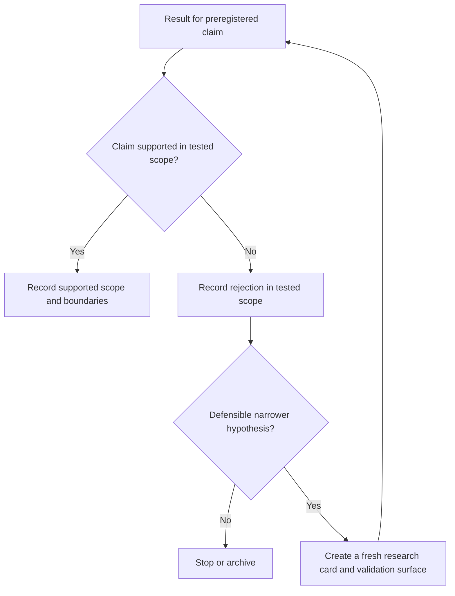
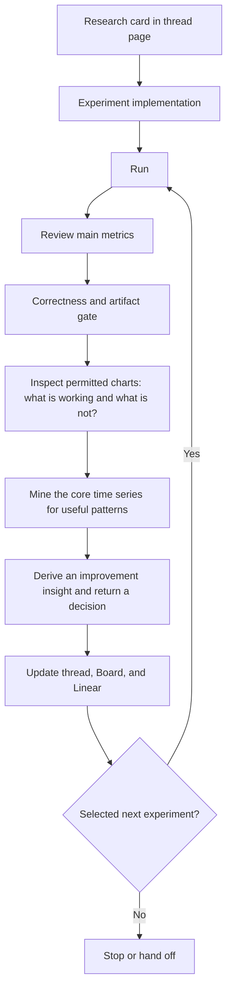

# Agentic Research Playbook

Status: in progress

## Evidence scope, diagnostic questions, and the alpha loop

**Purpose.** This playbook turns exploratory research into a disciplined, repeatable process. It is designed for an autonomous or human-supervised research agent working on quantitative strategies, but most of the logic applies to any empirical research program.

The operating idea is simple: every finding must earn a scope, every iteration must explain what worked and what did not, and every strategy change must move through a documented loop from concept to evidence.

Related operating context: [[research/trading/research_process_v2|Research Process V2]] · [[research/trading/research_index|Research Board]] · [[projects/agentic-research-loop-product-brief|Agentic Research Loop Product Brief]] · [[research/trading/alpha-inbox/overview|Alpha Inbox]]

### Applicability and precedence

Research Process V2 is the governing research protocol. It determines the lane, research card, evidence gates, holdout policy, cost regimes, search-budget accounting, promotion path, parallel-work boundaries, and Board/Linear synchronization. This playbook is the cycle-level diagnostic procedure used **inside one already-selected workstream**.

If the two documents appear to conflict, Research Process V2 controls. Lane-specific procedures—especially discretionary behavioral-parity work—also control over this generic loop.

Before using this playbook, the agent must have a bounded Linear issue or explicitly authorized research packet that names the question, research layer, evidence surface, decision boundary, likely shared files, and what must return to Destin.

### Agent inspection interface

The autonomous research interface is typed MCP evidence access, not the browser UI. Agents use the approved run-description, bounded-series, chart-rendering, and annotation tools for the research loop. The existing UI is for Destin's manual review; Browser Use is forbidden as a routine fallback and is allowed only when Destin explicitly requests UI inspection or the UI itself is under test.

If a required research type cannot expose its permitted numerical and visual evidence through the approved tool surface, classify that as a tool gap and block the affected playbook step. Do not bypass the contract with arbitrary output directories, unregistered scripts, or browser navigation. The product contract and first vertical slice are defined in the [[projects/agentic-research-loop-product-brief|Agentic Research Loop Product Brief]].

---

## 1. Core operating principles

1. **Find the widest scope the evidence supports.** Prefer a general rule, but accept a narrower rule when that is what the data supports.
2. **Quantify the boundary.** “Works in a regime” is not useful until the regime has a reproducible definition.
3. **Separate discovery from confirmation.** A pattern found during exploration is a hypothesis; it becomes evidence only after an appropriate holdout, perturbation, or replication test.
4. **Diagnose both success and failure.** Winning results may be artifacts; failed results may contain reusable components.
5. **Change one thing at a time when possible.** Preserve attribution between an intervention and its effect.
6. **Prefer reuse before invention.** Reuse proven features, tools, and methods before building a new tool. Composition still requires an explicit incremental hypothesis and isolated evaluation.
7. **Treat correlation as a stage-appropriate constraint.** Measure it when combining features, strategies, or portfolio exposures; do not reject a primitive solely because correlation is irrelevant to its current isolated question.
8. **Record the reasoning, not only the result.** Another agent should be able to reconstruct what was tried, why it was tried, and why the conclusion follows.
9. **Treat simple strategies as controls.** A one-signal → one-position implementation can isolate a primitive; it is not the assumed ceiling for market-state, forecasting, control, execution, or portfolio research.

---

## 2. Evidence-scope decision ladder

Use this ladder after a result appears promising to describe the widest scope the evidence actually supports. Test the preregistered claim first. Narrow only when the evidence requires it, and treat every newly narrowed rule as a **new hypothesis requiring fresh validation**—not as a validated salvage result from the same data.

### 2.1 Does it generalize?

Test whether the finding survives meaningful variation in assets, universes, time periods, market conditions, parameter settings, and reasonable implementation choices.

**Pass criteria**

- Direction and economic meaning remain stable.
- Performance is not concentrated in a tiny number of observations.
- Results survive costs, lagging, and plausible execution assumptions.
- The effect persists under perturbation rather than at one exact parameter value.
- Out-of-sample or replication evidence supports the original claim.

**If yes:** keep the finding as a general principle, state its known boundary conditions, and quantify confidence.

**If no:** do not discard it globally. Record the failed general claim, then generate a smaller-universe hypothesis only when there is an ex ante defensible boundary and fresh validation surface.

### 2.2 Is it consistent in a smaller universe?

Choose the smaller universe using an ex ante, defensible characteristic—not by collecting only the historical winners. Examples include liquidity tier, asset class, geography, market structure, sector, maturity, or data availability.

**If yes:** retain a universe-scoped rule and record:

- the inclusion and exclusion rules;
- the hypothesized reason the effect belongs in this universe;
- sensitivity to reasonable changes in the universe boundary; and
- the sample size and concentration of contribution.

**If no:** record the failed universe claim. A regime-specific rule is a new hypothesis and needs a reproducible classifier plus fresh validation evidence.

### 2.3 Is it consistent in a specific regime?

A regime must be identified and quantified before the strategy may condition on it. Avoid labels such as “risk-on” or “high volatility” without a reproducible classifier.

**A valid regime definition includes:** observable inputs, thresholds or model logic, measurement window, rebalance frequency, transition handling, minimum sample size, and a rule for classifying new data without look-ahead.

**If yes:** retain a conditional rule. Report both within-regime performance and the cost or risk of regime misclassification.

**If no:** record the failed regime claim. An asset-specific rule is a new hypothesis and needs its own mechanism and fresh validation evidence.

### 2.4 Is it consistent on one asset?

An asset-specific effect can be useful, but it carries the highest overfitting risk. Require a plausible structural mechanism, adequate history, stable execution assumptions, and evidence that the result is not driven by a handful of events.

**If yes:** label it explicitly as asset-specific. Size conservatively, monitor for decay, and avoid presenting it as a universal insight.

**If no:** stop. Archive the result with a concise failure reason and the conditions that would justify reopening it.

### Scope record

Every accepted finding should produce this record:

- **Claim:** one sentence describing the effect.
- **Research layer:** signal/feature / market state / forecast / position-control / execution / portfolio.
- **Scope:** general / smaller universe / regime / single asset.
- **Boundary:** explicit inclusion, exclusion, and trigger logic.
- **Evidence:** development, holdout, perturbation, and cost-aware results.
- **Mechanism:** why the effect may exist.
- **Fragility:** known failure modes and concentration risks.
- **Validity state:** supported / rejected-in-scope / untested.
- **Forecast state:** supported / rejected-in-scope / not applicable / untested.
- **Control and monetization state:** captured / capture-open / rejected mapping / untested.
- **Portability:** portable component versus market-specific capture, parameters, and execution.
- **Monitoring:** decay indicators and invalidation threshold.

---

## 3. At every step: diagnose what is working and what is not

Run both columns after each meaningful experiment. A promising result still needs a failure audit; an unsuccessful result still needs a salvage audit.

### 3.1 What is working?

Ask:

1. **What contributed?** Decompose the result by feature, asset, period, regime, direction, trade type, and cost assumption.
2. **Can it be amplified safely?** Increase exposure only after checking turnover, capacity, tail risk, and nonlinear failure.
3. **Can it be isolated?** Remove or neutralize other components to verify that the candidate feature is causal or at least incrementally useful.
4. **Is it specific or transferable?** Apply the evidence-scope ladder before broadening the claim.
5. **What would falsify it?** State the observation that would cause the agent to reject or narrow the idea.

### 3.2 What is not working?

First classify the failure:

- **Hypothesis failure:** the proposed relationship is absent or economically too weak.
- **Data failure:** leakage, survivorship bias, poor coverage, timestamp errors, or unstable definitions.
- **Tool failure:** the method cannot express, test, or inspect the hypothesis reliably.
- **Execution failure:** costs, latency, capacity, or operational constraints erase the apparent edge.
- **Evaluation failure:** the selected metric or benchmark does not answer the actual question.

Then ask:

1. **Have we solved this before?** Search the experiment log, concept library, and prior research.
2. **Which existing tools can solve it?** Prefer an established method with known behavior.
3. **Should we build a new tool?** Build only when a recurring capability gap blocks a valuable class of tests. Define inputs, outputs, validation cases, and maintenance owner first.
4. **Can a proven feature be composed here?** Test incremental benefit, not just standalone performance.
5. **How correlated is the proposed component?** Measure correlation of both raw signals and realized returns; inspect conditional correlation during stress.
6. **Is there raw research that has not yet been applied?** Convert relevant papers, notes, or theory into a falsifiable test and route reusable primitives through the Trading Catalog implementation/evaluation queue rather than copying a published recipe unchanged.

### Intervention rule

For every adjustment, record: **observation → hypothesis → intervention → expected metric movement → actual movement → decision**. If several variables change at once, label the result as low-attribution evidence.

---

## 4. The alpha loop

The alpha loop is the operating cycle that converts an idea into a maintained research concept.

### Step 1 — Complete the research card

Complete the Research Process V2 hypothesis contract in the existing per-thread research page before tuning. Do not create a parallel `Concept.md` when the thread page already exists. Include:

- economic or behavioral thesis;
- expected sign and timing;
- target scope and likely boundary conditions;
- data and feature definitions;
- benchmark and primary metric;
- expected failure modes;
- falsification test;
- development, validation, and untouched-holdout plan;
- realistic achievable and stress cost regimes;
- null/random-entry or other cheap falsification control where applicable;
- cumulative search-budget count;
- research layer and deployment target, including venue/account isolation when relevant;
- permitted discovery/validation surfaces for visual review;
- likely shared files and collision dependencies; and
- next decision the run will inform.

### Step 2 — Create the experiment implementation

Use the smallest artifact that can answer the question. Depending on the research layer, this may be an event study, analysis script, signal-validity test, market-state classifier, forecasting model, position-mapping test, registered strategy/backtest file, or execution simulation.

Create a strategy file only when the question actually requires a complete capture policy. A strategy implementation should specify signal construction, normalization, position mapping, constraints, cost model, rebalance logic, missing-data behavior, and risk controls. Keep configuration separate from research code where practical.

### Step 3 — Run

Execute a reproducible experiment. Save the code or version identifier, configuration, data snapshot or lineage, environment details, random seed when relevant, and a unique run ID. Generated evidence belongs in the registered research-run artifact workspace, never in an application source package.

Record the expected result before viewing the outcome. Evaluate both the realistic achievable and stress cost regimes when the experiment has trading economics. Increment the project-wide search-budget counter.

### Step 4 — Review main metrics

Read the headline metrics first, but do not decide from them alone. At minimum review return, volatility, drawdown, risk-adjusted return, turnover, costs, hit rate, exposure, concentration, and sample size. Compare against the declared benchmark and acceptance threshold.

Persisted run IDs and approved MCP saved-run/research-run tools remain the source of truth for standard metrics. The backtest UI remains Destin's human review surface, not the autonomous agent interface. The thread page records intent, run pointers, interpretation, and decisions rather than duplicating ordinary metric tables.

### Step 5 — Pass the correctness and artifact gate

Before interpreting charts as alpha evidence, verify that the experiment expressed the intended hypothesis:

- signal, indicator, model, and position semantics match the research card;
- intended and realized exposure agree at representative transitions;
- costs, fills, timestamps, and execution timing are represented as specified;
- missing-data, initialization, warmup, replay, reset, and duplicate/out-of-order behavior are valid where relevant;
- representative positive, negative, boundary, and failure cases are inspectable; and
- saved artifacts correspond to the intended run/configuration.

If this gate fails, classify the result as a tool/data/implementation failure. Repair or block the experiment before mining it for alpha; do not form market conclusions from defective behavior.

### Step 6 — Inspect permitted charts

Inspect the charts as a human researcher would inspect backtest results. The goal is not primarily to search for hard system errors. It is to understand **what is working, what is not working, where each behavior occurs, and what the visual evidence suggests trying next**.

Use the run-description tool before requesting a chart, then use the approved declarative chart renderer with explicit windows, series, panels, and annotations. Preserve the normalized render configuration and render ID with the research run. Do not use Browser Use for this step.

Do not treat the initial chart view as sufficient. Inspect the full **permitted discovery/validation surface**, never the untouched promotion holdout before its authorized one-time use. If a chart or artifact combines discovery data with hidden holdout data, create a bounded view before continuing.

The agent should interact with the permitted time series deliberately:

- scroll far enough left and right to examine the full permitted history;
- zoom out to understand the overall structure and zoom in around informative periods;
- compare winning, losing, typical, and unusual intervals;
- align related panels and inspect how signals, positions, returns, and market behavior evolve together;
- draw, mark, and label relevant regions, transitions, recurring shapes, or suspected relationships when annotation will make the reasoning clearer; and
- revisit earlier periods after forming a tentative explanation to see whether the same interpretation still holds.

At the end of the review, summarize the visual evidence under two headings: **What is working?** and **What is not working?** Distinguish direct observations from interpretations.

The visual-research loop is: **navigate → observe → compare → annotate → interpret → revisit**.

### Step 7 — Analyze the core time-series set

Use the raw and derived time series as material for pattern matching and idea generation. The agent should actively mine the series for recurring relationships, conditional behavior, and potentially useful structure—not merely verify that the data looks correct.

Retrieve bounded aligned windows through the approved numerical extraction surface. Do not infer numerical relationships solely from chart pixels or hydrate an unbounded artifact bundle when a bounded series query can answer the question.

Review aligned series together:

- **Signals:** raw and normalized signal values, coverage, saturation, and turnover.
- **Position:** intended and realized exposure, constraints, and lag.
- **ROE:** return on equity or the strategy’s chosen capital-efficiency measure; define the denominator explicitly.
- **P&L:** gross and net profit and loss, decomposed by asset, period, regime, and component.

Also inspect price or target series, costs, liquidity, drawdown, and benchmark exposure where relevant. Search for patterns such as:

- leads and lags between a signal, position change, and subsequent outcome;
- thresholds, saturation points, reversals, persistence, and decay;
- sequences that repeatedly precede strong or weak performance;
- asymmetric behavior across long and short positions or gains and losses;
- interactions between signals that are not useful in isolation;
- behavior that appears only within a particular universe, regime, or asset;
- recurring failure shapes that suggest a filter, exit rule, sizing change, or opposing feature; and
- differences between visually similar periods that may reveal a missing variable.

Use annotations or extracted windows to preserve the strongest examples. Record candidate patterns even when they are not yet proven, but label them as observations or hypotheses rather than conclusions.

### Step 8 — Derive an improvement insight and return a decision

Synthesize the metric review, chart inspection, raw-series mining, and working/failure diagnosis into a grounded **improvement insight** about the current concept. This is not a request to invent a separate alpha idea. It is the agent's best evidence-backed explanation of how the current signal, market-state representation, forecast, position control, execution, or evaluation could improve—or why the evidence does not support a useful improvement.

The insight may identify a feature interaction, filter, regime condition, timing rule, sizing rule, exit rule, risk control, missing variable, failure mechanism, or explanation for an observed behavior. When it supports another experiment, translate it into at most one selected next hypothesis for the current thread.

For each proposed idea, state:

- the specific observation that motivated it;
- the hypothesized relationship or mechanism;
- where the idea should and should not work;
- the expected effect on signals, positions, ROE, P&L, or another primary metric;
- the smallest targeted experiment that could test it; and
- what result would reject or materially revise it.

Then return one Research Process V2 decision: **promote, amplify/capture, continue, modify, extend, narrow, reject-in-scope, stop, or inconclusive/blocked**. A clean stop remains valid when the improvement insight is that no supported adjustment is likely to change the decision.

Prefer one well-supported improvement insight and, when warranted, one testable next hypothesis over a long list of weak possibilities. Only genuinely separate alpha concepts discovered incidentally belong in the [[research/trading/alpha-inbox/overview|Alpha Inbox]]; observations about improving the current concept stay in its research thread.

### Step 9 — Update durable state

Update the existing per-thread research page using the V2 living-head plus append-only-tail contract. Record new evidence, narrowed or expanded scope, rejected explanations, remaining uncertainty, run IDs, and the next selected test. Then update the Research Board and linked Linear issue/project in the same closeout when state, blocker, priority, or executable scope changed.

### Step 10 — Repeat or stop

Start another run only when the next experiment has a named question, fresh or still-permitted evidence, remaining search budget, and a decision it can change. Otherwise stop or hand off. Avoid unbounded parameter search disguised as iteration.

---

## 5. Agent execution contract

For each research cycle, the agent should return:

1. **Question:** the decision this experiment informs.
2. **Hypothesis:** expected relationship and mechanism.
3. **Test:** data, scope, intervention, benchmark, and acceptance threshold.
4. **Result:** primary metrics plus the most diagnostic charts or decompositions.
5. **Attribution:** what appears to be working and why.
6. **Failure analysis:** what is not working and the failure class.
7. **Improvement insight:** the evidence-backed insight about how the current concept could improve, or why no supported improvement is available.
8. **Layer and scope decision:** signal/feature, market state, forecast, control, execution, or portfolio; general, universe, regime, asset, or rejected-in-scope.
9. **Risks:** leakage, concentration, correlation, costs, and model uncertainty.
10. **Decision:** promote, amplify/capture, continue, modify, extend, narrow, reject-in-scope, stop, or inconclusive/blocked.
11. **Next action:** one prioritized test with a stop condition.

The agent must distinguish **observation**, **inference**, and **decision**. It must not silently expand a claim beyond the tested scope.

---

## 6. Stop and escalation conditions

Stop or escalate when:

- no supported scope remains after the decision ladder;
- the result depends on leakage, unavailable data, or irreproducible processing;
- costs or execution assumptions erase the effect;
- repeated iterations do not change the decision;
- the experiment cannot identify which change caused the result;
- a new tool would require material engineering outside the research mandate;
- the proposed action exceeds risk, capital, or operational authority; or
- evidence conflicts and the choice would be consequential.

Archive stopped work with enough context to prevent another agent from unknowingly repeating it.

---

## 7. Compact run checklist

### Before the run

- [ ] One decision question is named.
- [ ] Lane and research layer are named.
- [ ] The hypothesis and falsification condition are written.
- [ ] Scope, benchmark, realistic/stress costs, and acceptance threshold are fixed.
- [ ] Data lineage and leakage checks are complete.
- [ ] Discovery, validation, visual-review, and untouched-holdout surfaces are explicit.
- [ ] Expected result is recorded before results and the cumulative search budget is current.
- [ ] Shared files, fixtures, and parallel-work collisions are checked.
- [ ] The change from the prior run is isolated.

### After the run

- [ ] Main metrics and core time series were reviewed.
- [ ] Correctness and artifact gates passed before alpha interpretation.
- [ ] Contribution, concentration, and correlation were decomposed.
- [ ] “Working” and “not working” questions were answered.
- [ ] A grounded improvement insight—or evidence that no useful improvement is supported—was recorded for the current concept.
- [ ] The evidence-scope ladder was applied without treating adaptive narrowing as confirmation.
- [ ] The thread page, Research Board, and Linear were synchronized as required.
- [ ] Current-concept improvement observations stayed in the thread; only genuinely separate alpha concepts were routed to the Alpha Inbox.
- [ ] The next action—or stop—has a decision and stop condition.

---
