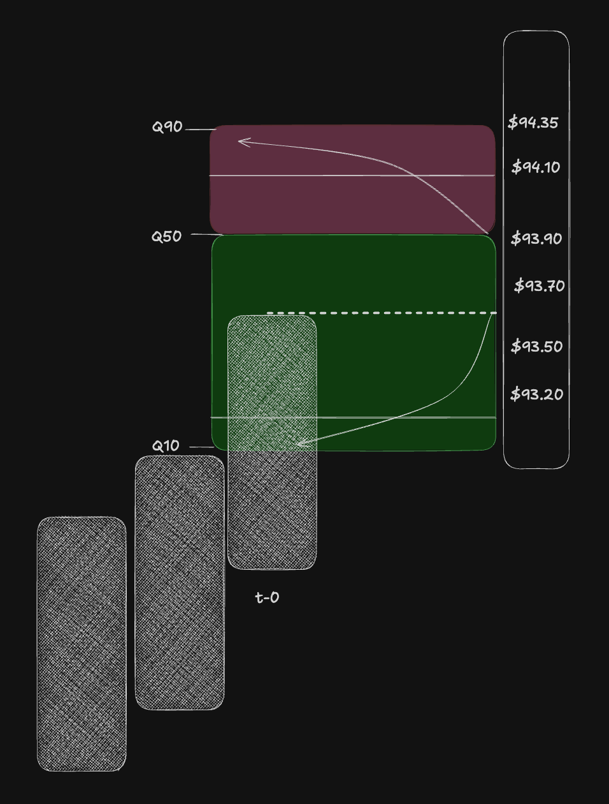
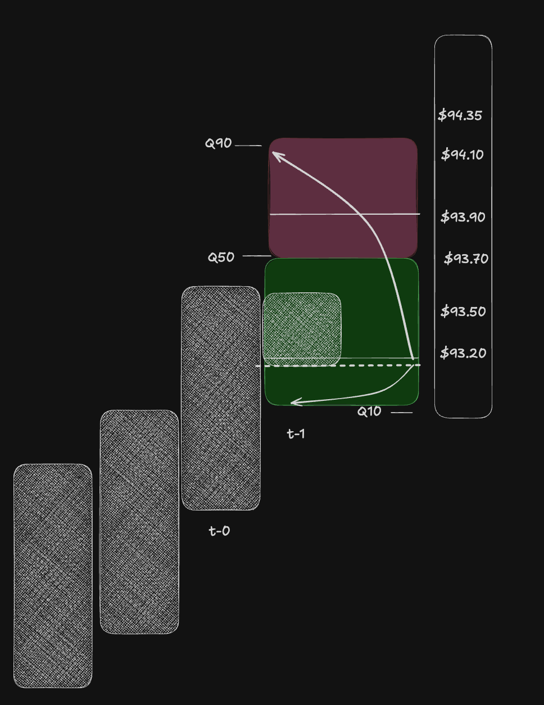
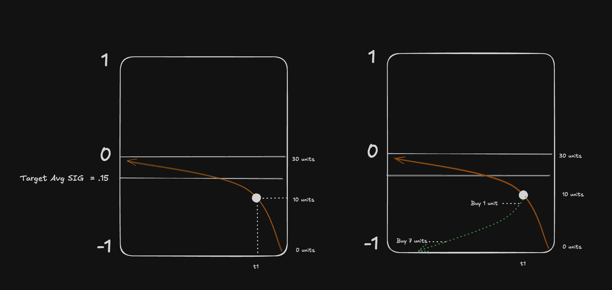

# Size Distribution (Inventory Accumulation and Distribution)

Status: in progress

Concept elicitation began 2026-07-26. The core architecture was confirmed 2026-08-06. Existing skew helpers and Positions Lab encode an earlier absolute-target hypothesis and are not the accepted contract. No implementation formula or backtest claim is accepted yet.

Related: [[trading/catalog_v1|Trading Catalog]], current experimental helpers in `mm_v04/backend/app/helpers/signal_position.py`.

## TL;DR

Size distribution is **not one nonlinear signal-to-target-position curve**.

It is two concurrent, one-sided transaction-allocation schedules:

1. **Accumulation schedule:** how many additional units may be acquired at each price or signal point, bounded by remaining capacity to a maximum inventory.
2. **Distribution schedule:** how many units of current inventory should be released at each price or signal point, bounded by inventory that actually exists.

The schedules coexist. Price or signal traversal determines which orders become actionable. No accumulation/distribution mode switch is required.

## Problem

Scaling inventory linearly through a range places equal transaction size throughout the path. The resulting average transaction price sits near the middle and can be economically poor even when position polarity is correct.

For inverse trend positioning:

- compression toward the moving average increases inventory;
- extension away from the moving average reduces inventory;
- linear increments can still leave the accumulated position underwater.

Exchange scale-order controls solve the discrete version by distributing unequal quantities across a price range. Curve, direction, and amount control where transaction mass is concentrated.

## Confirmed architecture

### Accumulation is capacity-constrained acquisition

The accumulation schedule specifies:

- the price or signal range over which inventory may increase;
- the curve that distributes additions across that range;
- the maximum inventory;
- the quantity currently available to acquire.

For long inventory magnitude `q` with maximum `q_max`:

\[
0 \leq \Delta q_{acc} \leq q_{max}-q
\]

The short side is symmetric in inventory magnitude. Accumulation can only add in the existing intended direction; it does not reduce or reverse the position.

### Distribution is inventory-constrained release

The distribution schedule specifies:

- the price or signal range over which current inventory may be released;
- the curve that distributes reductions across that range;
- the amount currently available to distribute.

For current inventory magnitude `q`:

\[
0 \leq \Delta q_{dist} \leq q
\]

Distribution can reduce the position to flat at most. It cannot create inventory, pass through flat, or establish the opposite position.

For a long position:

\[
q_{t+1}=q_t+\Delta q_{acc}-\Delta q_{dist}
\]

The short side uses the same magnitude accounting with side-aware execution: accumulate short by selling and distribute short inventory by buying to cover.

### The curves are transaction schedules, not absolute targets

A label such as `1 unit` or `7 units` on a distribution curve means **units to release at that coordinate**. It does not mean target inventory of 1 or 7.

Likewise, the distribution curve's total amount is current inventory, not maximum strategy inventory. If ten short units exist, the cover schedule may allocate at most ten units across its range even when the accumulation maximum is thirty.

This asymmetry is why the two concepts cannot be collapsed into alternate absolute-position curves.

## Price-space model

Think like a market maker managing inventory at favorable prices.

The paired reference sketches preserve the accepted time-0/time-1 price-space example. The quantity marks describe bounded transaction allocations and inventory available to the schedules, not a nonlinear absolute-position target:

Example, long side at time 0:

- current inventory: 2;
- average entry: 98.50;
- current price: 98.50;
- accumulation range: 98.49 to 97.00;
- accumulation allocation: buy up to 10 additional units, producing maximum inventory 12;
- distribution range: 98.51 to 100.00;
- distribution allocation: sell at most the 2 units currently owned.

At time 1, price has fallen to 98.10 and traversed part of the accumulation range:

- current inventory becomes 5;
- average entry improves to 98.25;
- remaining accumulation capacity becomes 7;
- distribution capacity becomes 5;
- the strategy may update the distribution range to reflect the new average entry and desired exit prices.

Nothing switched from accumulation to distribution. Both schedules existed throughout. A subsequent rise traverses the distribution schedule; a further fall traverses more of the accumulation schedule.

## Accepted refresh lifecycle

The time-0/time-1 example is a sequence of fresh inventory snapshots, not a stateful curve carrying fill progress forever:

1. At time 0, the caller builds both schedules from current inventory, maximum inventory, average entry, and strategy-selected ranges.
2. Coordinate movement alone does not change inventory. A transaction fill made actionable during traversal changes inventory and may change average entry.
3. After the fill, the caller invalidates and rebuilds both schedules from the new snapshot.
4. The fresh accumulation total is remaining capacity, `max(0, maximum inventory - current inventory)`. The fresh distribution total is current inventory.

The caller owns refresh timing. Rebuilding after every fill is the accepted normal use, while batching fills or refreshing on another strategy event remains a caller policy. Any unfilled allocation from the replaced plan must be cancelled/replaced or counted as reserved capacity by the execution layer; that state does not belong in the generic curve.

## Accepted generic curve contract and implementation progress

The generic curve is a stateless description of one fresh plan:

- it receives exactly two range coordinates, start and end, plus the coordinate being evaluated;
- it is coordinate-agnostic and works in price space or signal space;
- it receives the total transaction quantity, curve family, skew amount, and whether size is weighted toward the numerically lower or higher end;
- it returns the transaction quantity allocated by that fresh plan at the evaluated coordinate, bounded from zero at the start to the total quantity at the end;
- it does not receive completed quantity, inventory, average entry, strategy direction, fill state, or refresh state.

Discrete sampling or execution placement may consume the continuous curve later, but a list of supplied levels is not part of the accepted core contract.

The quantity-weighted average of a price-space curve is its implied average transaction price. The same calculation in signal space is an implied average transaction signal coordinate, such as `-0.12`; actual average entry price still requires observed transaction prices.

Local implementation work has established two small helpers:

- `backend/app/helpers/allocation_curve.py` exposes `scheduled_quantity_at_coordinate(...)` with the stateless contract above;
- `backend/app/helpers/position_schedule.py` independently caps accumulation by remaining capacity and distribution by current inventory, preventing release through flat.

An interactive design lab was also used to confirm that simulated fills update inventory, remaining capacity, releasable inventory, transaction average, and average entry, and that accumulation and distribution curves can be weighted independently. Action mapping, strategy wiring, deterministic tests, linting, and economic backtests remain unfinished. Tests and linting are intentionally deferred until the reviewed implementation steps are complete.

## Implementation checkpoint — 2026-08-13

The first bounded implementation and deterministic-verification pass is complete locally in `mm_v04`:

- `backend/app/helpers/allocation_curve.py` implements the stateless continuous allocation query across exactly two endpoints, with cubic or exponential shape and numerical Lower/Higher weighting;
- `backend/app/helpers/position_schedule.py` derives fresh accumulation totals from remaining capacity and fresh distribution totals from current inventory, composes those totals with independently configured curves, retains final quantity caps, and maps `accumulate|distribute` plus `long|short` into `buy|sell` and reduce-only semantics;
- `backend/app/backtest/strategies/positions_lab.py` no longer uses the rejected absolute-target or one-bar motion-switching model. The non-trading backtest lab now emits simultaneous accumulation/distribution allocations and their snapshot-derived totals from a fixed inventory snapshot.

Thirty-one focused deterministic tests pass. They cover curve endpoints and clamping, linear zero-weight behavior, cubic/exponential Lower/Higher weighting, reversed ranges, price/signal normalized equivalence, invalid inputs, the accepted time-0/time-1 inventory totals (`2/12 → 10 accumulation and 2 distribution`; `5/12 → 7 and 5`), caps, and all four side-aware execution mappings. Focused Ruff format/check and mypy pass across the three implementation files and two new test files.

This checkpoint verifies the headless contract; it is not an economic backtest and does not create orders. The backtest lab is not a satisfactory curve-tuning interface. A separate interactive Position Lab UI is desired later for visual fine-tuning, simulated fills, average-entry changes, and schedule rebuilds. Strategy wiring, execution-layer replacement/reservation handling, economic evaluation, and live/capital mutation remain out of scope and unfinished.

## Interactive Position Lab closure — 2026-08-13

The separate interactive Position Lab is now implemented locally in `mm_v04` and closes the accepted MON-168 evaluation surface:

- an authenticated read-only preview endpoint rebuilds both schedules from the submitted inventory snapshot without database, order, position, or live-runtime mutation;
- the frontend supports price or signal coordinates, long or short inventory, independent accumulation/distribution ranges and curve controls, dynamic capacity/releasable inventory, simultaneous curve display, and side-aware execution/reduce-only labels;
- the chart displays current coordinate, inventory average coordinate, full accumulation/distribution implied averages, explicit schedule ranges, and endpoints without animation flashes during coordinate movement;
- accumulation and distribution have separate simulated-fill actions so overlapping actionable schedules are never silently resolved;
- each simulated fill creates the next local snapshot and rebuilds both schedules. Accumulation updates the quantity-weighted average price or signal coordinate; distribution preserves that average while inventory remains and clears it at flat;
- lifecycle history records `t0`, `t1`, and later local snapshots. Manual snapshot edits reset that local history.

Final deterministic verification comprises 31 backend allocation/controller tests and six frontend lifecycle tests. The frontend production build and lint pass; scoped backend Ruff and mypy pass. MON-168 is Done. Deferred overlay toggles, undo/reset, saved configurations, richer lifecycle comparison, strategy-owned anchors, refresh/reservation policy, discrete quote placement/rounding, economic backtests, and any later execution integration are recorded in [MON-224](https://linear.app/money-machine/issue/MON-224/extend-position-lab-controls-persistence-and-strategy-integration). No live or capital mutation occurred.

## Favorable price orientations

`Higher` and `Lower` name the **price end receiving more transaction size**. They do not name signal direction, position side, or motion toward zero.

For one-sided passive ranges:

| Order range | More size toward current | More size away from current |
|---|---|---|
| Buy/long limits below current price | `Higher` — more aggressive, worse average | `Lower` — more passive, better average |
| Sell/short limits above current price | `Lower` — more aggressive, worse average | `Higher` — more passive, better average |

Favorable round trips therefore use opposing transaction orientations:

- long: accumulate with Lower buys; distribute with Higher sells;
- short: accumulate with Higher sells; distribute with Lower buys/covers.

One shared curve cannot produce favorable averages for both acquisition and release.

## Signal-space translation

Price space defines the economics. Signal space supplies a proxy coordinate for traversal.

The corresponding signal-space sketch is also unit-based accumulation and distribution. Labels such as `Buy 1 unit` and `Buy 7 units` are transaction tranches allocated by the schedules; they are not absolute-position targets:

For the confirmed short inverse example:

- signal `-1` is the extended end with zero short inventory;
- compression toward `0` traverses the accumulation schedule;
- maximum short inventory is 30 units;
- at an intermediate signal, 10 short units may have accumulated;
- a separate distribution schedule allocates only those 10 units over subsequent extension back toward `-1`;
- distribution labels are cover quantities at signal points, not target-position magnitudes.

The accumulation schedule answers:

> How many more units may I acquire here, subject to maximum inventory?

The distribution schedule answers:

> How many of the units I currently own should I release here?

Signal magnitude can therefore index both schedules without choosing between two complete target-position functions.

## Strategy policy versus generic mapping

Anchoring the distribution range to average entry price is a **strategy decision**, not a universal mapping rule.

For the current trend example, the strategy may prohibit ordinary distribution before the position is in the money. Another strategy may intentionally reduce underwater inventory because of forecast deterioration, stops, time limits, risk constraints, or portfolio needs.

Keep the responsibilities separate:

1. **Mapping function:** distribute a bounded quantity across a supplied range using curve, direction, and amount.
2. **Inventory controller:** cap accumulation by remaining capacity and distribution by current inventory; translate acquire/release into side-aware orders.
3. **Strategy:** choose accumulation/distribution ranges and policies, including any average-entry profitability gate.
4. **Risk and exit overrides:** permit reductions regardless of average entry when strategy or portfolio safety requires them.

Quote placement and price spacing remain separate from size distribution.

## Why the prior implementation failed

The first experiment created two nonlinear **absolute target-position** curves and selected between them from one-bar signal-magnitude motion.

That collapsed four distinct concepts into one function:

- acquisition range;
- acquisition quantity;
- release range;
- releasable current inventory.

At the same signal magnitude the two absolute curves produced different total targets. Switching curves therefore created discontinuities, jagged targets, and wrong-direction adjustments.

The corrected model does not select an accumulation curve or a distribution curve as the position target. It maintains both transaction schedules and applies their one-sided inventory constraints.

## Exchange size-distribution knobs

| Knob | Meaning |
|---|---|
| **Curve** | Shape of transaction-size allocation, such as cubic or exponential |
| **Direction** | `Lower` or `Higher`: which price end receives more size |
| **Amount** | Strength of the skew; `0%` is even/linear allocation |

These knobs shape quantity allocation within a supplied range. They do not determine signal polarity, strategy direction, maximum inventory, or whether inventory should be accumulated versus distributed.

## Current experimental code

- `signal_to_position` — legacy linear direct/inverse absolute target.
- `signal_to_position_banded` — linear absolute target over a caller-supplied magnitude band.
- `signal_to_position_banded_skewed` — experimental inverse-only warped absolute target.
- `band_end_from_motion_inverse` — experimental one-bar motion selector.
- the prior `positions_lab` implementation — demonstrated the rejected switching behavior; the local MON-168 replacement now emits concurrent bounded transaction schedules as recorded above.

These functions may contain reusable curve-warp mathematics, but their absolute-target contract is not the confirmed size-distribution architecture.

## Accepted implementation direction

Future work should model accumulation and distribution separately as bounded transaction-allocation schedules. It must preserve these invariants:

- both schedules may exist simultaneously;
- acquisition cannot exceed remaining maximum capacity;
- distribution cannot exceed current inventory;
- distribution cannot cross through flat;
- side translates acquisition/release into buy, sell, short, or cover;
- strategy owns ranges and profitability/risk gates;
- curve helpers remain agnostic to strategy semantics;
- outputs represent transaction quantities, never ambiguous absolute-position targets.

No strategy wiring or economic backtest is accepted until the schedule semantics and deterministic examples are implemented and verified.
