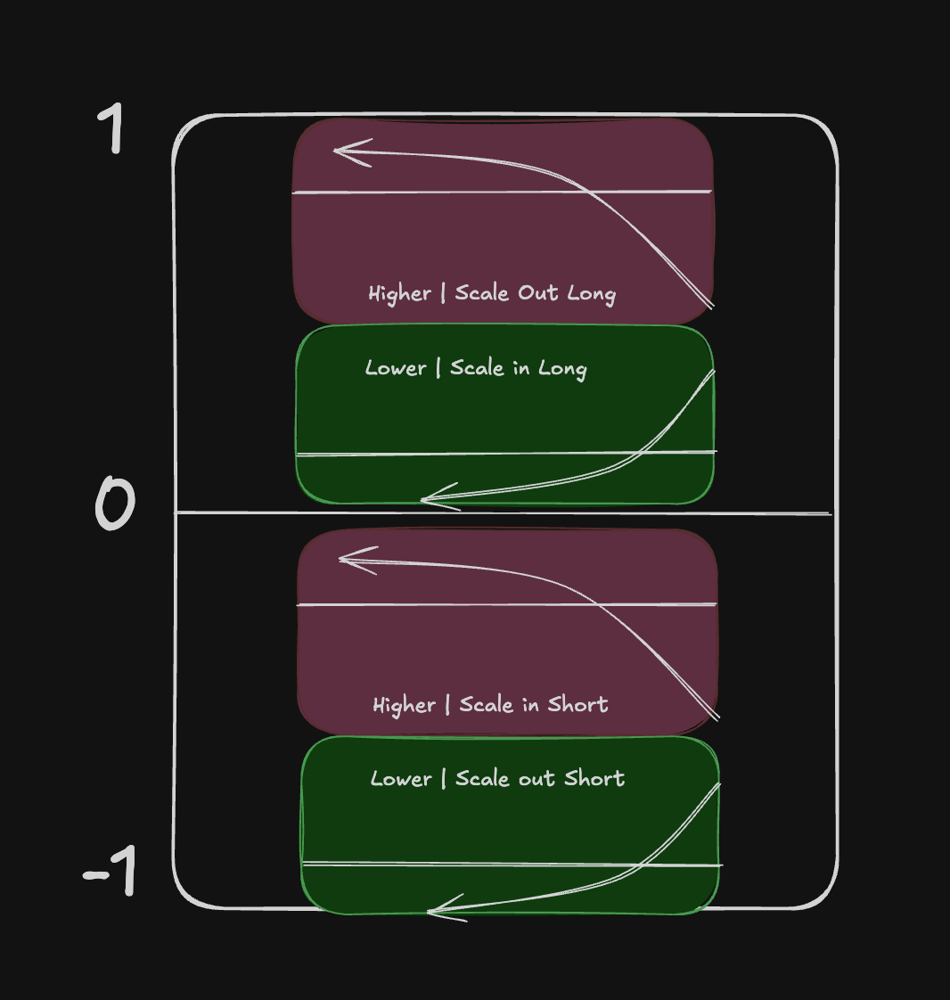
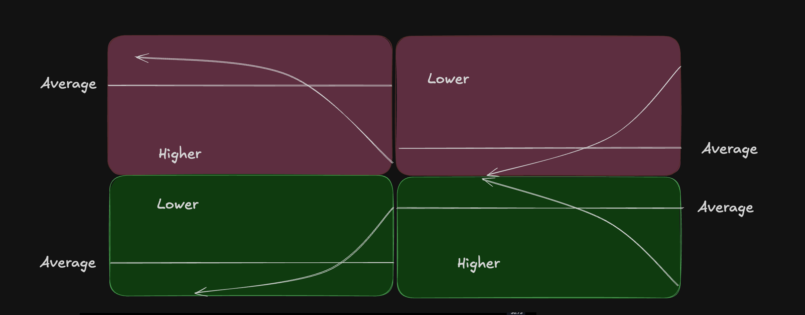

# Size Distribution (Signal → Position Skew)

Status: in progress

Concept elicitation began 2026-07-26. An experimental inverse banded-skew helper and Positions Lab exist, but their behavior is not accepted. No formula or control contract is finalized and there are no backtest claims.

Related: [[trading/catalog_v1|Trading Catalog]], current linear helper in `mm_v04` at `backend/app/helpers/signal_position.py`.

Interactive concept demo (Cursor canvas): `size-distribution.canvas.tsx` under the mm_v04 canvases folder. Canvas mid-cut zones are stale relative to the continuous rule below — update when convenient.

## Problem

Scaling in and out **linearly** along a path puts size mass evenly through the region. The resulting average sits mid-path and is often adverse.

Exchange scale-order UIs fix the discrete case with **size distribution** skew (curve type + direction + intensity) so the average is pulled toward a chosen end of the band. Continuous signal→position has the same failure mode: even with correct polarity (e.g. `inverse` accumulate-on-compression), linear size steps still leave the average mid-path — e.g. underwater vs price while short.

### Example: linear inverse underwater average


`inverse` polarity is doing the right thing directionally (size grows as signal compresses toward 0). The failure is the **path**: equal size increments along the walk → mid-path average.

On the same chart: when extension moves **toward** zero, `|position|` grows (scale in); when extension moves **away** from zero, `|position|` shrinks (scale out). That happens anywhere on the path — not only past a mid-band cut.

## Confirmed intended outcome (2026-08-02)

Destin confirmed the following behavior through the underwater-average example and exchange scale-order examples:

- Linear inverse sizing is directionally correct in the example: position grows as EMAC compression moves toward zero and shrinks as EMAC extends away from zero.
- Its failure is inventory allocation. Equal position increments along the accumulation path leave the average entry near the middle of the traversed price range and can leave the accumulating position underwater.
- The practical exchange analogue establishes **one fixed size-allocation curve over one side of a price range**. Unequal limit-order sizes concentrate inventory at the favorable end and pull the weighted average toward that end.
- `Higher` and `Lower` name the **price end** receiving more size. They do not name signal direction or motion relative to zero.
- `Toward current` and `Away from current` describe a separate relative orientation. Lower/Higher alone does not mean aggressive/passive or favorable/unfavorable; that depends on which side of the current price contains the order range.
- Quote skew / order spacing is separate from size distribution / inventory weighting.
- The continuous implementation does **not** receive an explicit price range. Caller-supplied `band_inner` / `band_outer` define the active EMAC signal range, and movement through that range is intentionally used as a proxy for progress through the implicit price range.

For one-sided passive limit ranges:

| Order range | End toward current price | End away from current price |
|---|---|---|
| Buy/long limits below current price | `Higher` — more aggressive, worse average | `Lower` — more passive, more favorable average |
| Sell/short limits above current price | `Lower` — more aggressive, worse average | `Higher` — more passive, more favorable average |

Therefore, weighting both sides **toward the current price** is fairly modeled as Higher for buys below and Lower for sells above. Weighting both sides **away from the current price** reverses those labels: Lower for buys and Higher for sells.

Confirmed short example:

- As EMAC compression moves toward zero and price rises, the short accumulates through the upper price range. Use a **Higher** distribution so most short inventory is sold nearer the favorable high end, pulling the entry average upward.
- After EMAC turns and extends away from zero while price falls, the short is reduced through the lower price range. Use a **Lower** distribution so more covering occurs nearer the favorable low end.
- Each leg establishes its own fixed allocation curve across its price range. The position grows continuously through the accumulation leg and shrinks continuously through the reduction leg.

### Why one shared curve is insufficient

A single distribution reused in both transaction directions produces the same weighted region for entry and exit. For example, buying through a Lower distribution can produce a favorable low average, but selling the acquired inventory through that same Lower distribution would also produce a low exit average.

Capturing favorable averages on both sides of a completed range requires opposing transaction distributions:

- Long round trip: buy with `Lower`, sell with `Higher`.
- Short round trip: sell/short with `Higher`, buy/cover with `Lower`.

Therefore the design needs distinct accumulation and reduction allocation orientations. The unresolved problem is not whether two orientations are needed; it is how a per-candle signal-space controller retains or changes the active orientation without discontinuities when the proxy signal wiggles or reverses.

EMAC describes progression through the accumulation/reduction lifecycle and supplies the proxy coordinate for the curve. Higher/Lower retains its economic meaning in **price**, then side + active leg translate that intent onto the signal band's inner/outer ends. A one-bar EMAC wiggle must not reinterpret Higher/Lower or switch the complete allocation curve.

Still unresolved: the exact curve formula, whether the program represents incremental inventory or a cumulative target, what establishes a new accumulation/reduction leg in signal space, and what happens on partial reversals or interrupted legs. In price space, the intended allocation can be updated every candle; the equivalent signal-space rule has not been elicited.

## Scope

**Size distribution only** — how much size sits where in a region.

Out of scope here:

- **Quote / price spacing** (how far apart limit rungs sit) — separate exchange knob
- Exact cubic / exponential formulas
- Strategy wiring and backtest claims

## Exchange size-distribution knobs (ground truth)

From the exchange scale UI:

| Knob | Meaning |
|---|---|
| **Curve** | `cubic` or `exponential` — shape of the size pile |
| **Direction** | `Lower` or `Higher` — which end of the band gets the mass |
| **Amount** | `0–100%` — how hard to skew (`0%` = even / linear mass) |

Even → average near the middle of the band. Skew toward Higher / Lower → average follows that end.

These knobs are **not** a coordinate on the signal axis. Do not treat amount/direction as “skew = signal value.” Signal is a separate input; size distribution shapes mass along a region/path.

## Orthogonal knobs: polarity vs size shape

Keep two concerns separate:

1. **Polarity — `direct` / `inverse`** (exists today)
   - `direct`: larger `|signal|` → larger size
   - `inverse`: smaller `|signal|` → larger size (position grows near 0; e.g. accumulate as extension compresses toward a MA)
   - Do not replace polarity with the size-distribution curve

2. **Size distribution — curve + direction + amount** (proposed)
   - Reshapes how size is piled along the region/path so the average is not forced mid-path
   - Caller chooses Lower vs Higher from intended use (helper stays side-agnostic)

### Implementation preference

Code **`direct` and `inverse` as separate variants first** so each path’s size-distribution logic is correct. Unify into one elegant shared formula only after both behave right.

## Experimental signal-space mechanics — not reconfirmed

### Continuous updates: toward zero vs away (supersedes mid-cut zones)

Continuous position is updated **per bar**. For inverse, scale-in vs scale-out is about **motion relative to zero**, not which absolute band the signal sits in.

A fixed mid-cut (e.g. `±0.5`) does **not** work: `|position|` grows whenever the signal is moving toward zero, and shrinks whenever it is moving away — at any level on the axis.

### Detecting motion

Use change in **magnitude**, not the raw signed delta:

```text
d_abs = abs(sig[-1]) - abs(sig[-2])

d_abs < 0  → toward zero
d_abs > 0  → away from zero
d_abs == 0 → flat
```

Raw `sig[-1] - sig[-2]` is not enough: on the short side, moving toward zero is a *positive* signed delta; on the long side, moving toward zero is a *negative* signed delta. Same signed sign, opposite meaning. Comparing `|sig|` fixes both sides (and still answers closer/farther across a zero cross).

### Superseded implementation hypothesis — do not treat as the contract

The first experiment used motion to switch the entire absolute position target between an `inner` curve and an `outer` curve. That is not the confirmed price-leg model above. At the same signal magnitude the two curves produce different absolute targets, so switching curves creates discontinuities and can reduce during compression or add during extension — the opposite of the required position motion.

Magnitude motion remains useful for recognizing compression versus extension. It must not be used to switch complete absolute target curves on each bar.

### Active signal space (thresholds) — caller-owned

A strategy may set band endpoints in config. The real space for mapping is **not** assumed to be `[-1, 1]` or tied to `signal_scale`.

Caller supplies magnitude endpoints, e.g. `band_inner=0.1`, `band_outer=0.9` (or `30`–`80` in other units). That span is **100%** of the position map. Long/short share the band via `|signal|`; sign comes from the signal.

`|signal| < band_inner` is dead / flat. Invalid bands (negative inner, `outer <= inner`, mixed-sign outer like `0.3` / `-0.5`) must be rejected — do not silently coerce.

Only the strategy knows its thresholds. The helper stays agnostic over the band it is given.

Consequence for inverse “toward zero”: the inner edge of the active band is `band_inner`, not literal `0`. Motion toward the compressed end means toward that inner edge.

## Historical signal-axis sketches — not the allocation contract

Polarity and compression/extension can be described on the **signal axis**. The confirmed size-allocation axis is the price leg. The prior experiment translated Lower/Higher onto a caller-supplied signal-magnitude band; that translation is not the accepted contract.

### Inverse positioning (intent sketch — not the continuous control)



Useful only as historical **intent labels** (scale-in near zero vs scale-out toward ±1). It does not specify where in price inventory should be allocated.

### Why the signal-axis conversion failed

Destin confirmed that the diagram is a fair idealized lifecycle sketch:

- Long compression: `+1 → 0`, with price falling → scale in at Lower prices.
- Long extension: `0 → +1`, with price rising → scale out at Higher prices.
- Short compression: `-1 → 0`, with price rising → scale in at Higher prices.
- Short extension: `0 → -1`, with price falling → scale out at Lower prices.

It is not, by itself, a valid `signal → position` function:

- At the same nonzero signal magnitude, it contains two possible curves: the accumulation leg and the reduction leg. Signal level alone does not identify the active leg.
- Using EMAC movement as a proxy for progress through the implicit price range is intentional. The diagram did not specify how long one fixed proxy curve remains active or when the system may change from the accumulation curve to the reduction curve.
- The arrows describe whole path-dependent legs. Converting them into stateless absolute targets discards the leg identity, its price range, and the existing inventory path.
- Selecting between the two absolute curves from consecutive signal motion causes the observed target discontinuities and wrong-direction adjustments.

The durable separation is: **Higher/Lower price intent + side + active leg** select the allocation orientation; the caller's **EMAC signal band** supplies the proxy range and progress coordinate; **position state** preserves continuity while one fixed curve remains active. The exact transition and reversal rules remain open.

| Side | Intent near `0` | Intent toward extended end |
|---|---|---|
| Long (`signal > 0`) | scale **in** long | scale **out** long |
| Short (`signal < 0`) | scale **in** short | scale **out** short |

### Higher/Lower mass sketch



Higher vs Lower names which end of a region gets the pile; the average follows that end.

## Current code (experimental, not the accepted contract)

- Legacy `signal_to_position` — unchanged; linear `direct` / `inverse` over `[-signal_scale, signal_scale]`.
- Opt-in `signal_to_position_banded` — linear map over caller `[band_inner, band_outer]` magnitudes.
- Opt-in `signal_to_position_banded_skewed` — **inverse only**; band + cubic/exponential warp toward `inner`/`outer`; `amount_pct=0` matches inverse banded. Direct skew not implemented.
- Helpers: `warp_unit_interval`, `band_end_from_motion_inverse` (compress→inner, extend→outer).
- `positions_lab` switches the skew helper's complete absolute target between `inner` and `outer` from consecutive processed-signal magnitudes. UI review on 2026-08-02 exposed jagged targets and wrong-direction adjustments at those switches.

Asymmetric long/short: caller picks side magnitudes before calling. Dynamic bands: pass this bar’s endpoints. Piecewise multi-knot maps stay strategy-owned.

**Linear track: on hold** (2026-07-28). Banded helper is enough for single magnitude bands (static or dynamic); not chasing strategy migration or asymmetric API sugar now.

## Experimental non-linear size distribution

Opt-in inverse-only `signal_to_position_banded_skewed` + `warp_unit_interval` / `band_end_from_motion_inverse` in `signal_position.py`.

Knobs:

- Curve: `cubic` | `exponential` (generic; NumPy `power` / `expm1` — not HL-specific)
- `toward`: `inner` | `outer` on the **magnitude band** (not Lower/Higher)
- Amount: `0–100%` (`0` = same as linear inverse banded)

The experimental helper translated Lower/Higher into signed signal-axis vocabulary: toward inner is Lower on the long side and Higher on the short side. This is implementation history, not the confirmed price-leg contract. See canvas `toward-away-lower-higher.canvas.tsx`.

`band_end_from_motion_inverse(sig, prev)` maps `d_abs` → `inner` / `outer` / `None` for inverse only (compress → scale-in → inner; extend → scale-out → outer). Direct motion→toward is undefined / not implemented. Caller passes `toward` (or holds prior on flat).

## Open for later

- Define the nonlinear curve from the confirmed fixed price-leg allocation behavior before changing the helper.
- Decide whether code represents per-step inventory allocation, cumulative position target, or both.
- Define price-leg anchoring, endpoints, interrupted legs, partial reversals, and continuity requirements.
- Redesign Positions Lab to compare the accepted allocation and resulting average price, not only absolute signal targets.
- Direct-polarity skewed variant (only if/when motion→toward is defined for direct)
- Discrete scale-order ladder sharing `warp_unit_interval`
- Direct-polarity curve diagram
- Refresh older size-distribution canvas (mid-cut zones stale)
