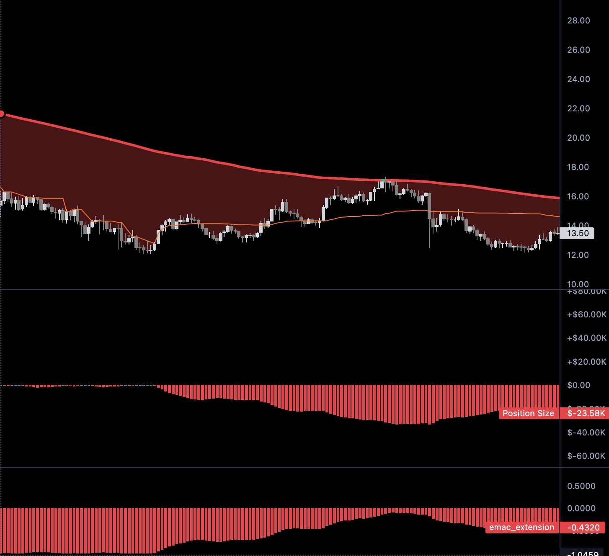

# Size Distribution (Signal → Position Skew)

Status: in progress

Concept note from elicitation (2026-07-26). Not implemented. No formulas finalized, no strategy wiring, no backtest claims.

Related: [[trading/catalog|Trading Catalog]], current linear helper in `mm_v04` at `backend/app/helpers/signal_position.py`.

Interactive concept demo (Cursor canvas): `size-distribution.canvas.tsx` under the mm_v04 canvases folder. Canvas mid-cut zones are stale relative to the continuous rule below — update when convenient.

## Problem

Scaling in and out **linearly** along a path puts size mass evenly through the region. The resulting average sits mid-path and is often adverse.

Exchange scale-order UIs fix the discrete case with **size distribution** skew (curve type + direction + intensity) so the average is pulled toward a chosen end of the band. Continuous signal→position has the same failure mode: even with correct polarity (e.g. `inverse` accumulate-on-compression), linear size steps still leave the average mid-path — e.g. underwater vs price while short.

### Example: linear inverse underwater average



`inverse` polarity is doing the right thing directionally (size grows as signal compresses toward 0). The failure is the **path**: equal size increments along the walk → mid-path average.

On the same chart: when extension moves **toward** zero, `|position|` grows (scale in); when extension moves **away** from zero, `|position|` shrinks (scale out). That happens anywhere on the path — not only past a mid-band cut.

## Scope

**Size distribution only** — how much size sits where in a region.

Out of scope here:

- **Quote / price spacing** (how far apart limit rungs sit) — separate exchange knob
- Exact cubic / exponential formulas
- Strategy wiring and backtest claims

## Exchange size-distribution knobs (ground truth)

From the exchange scale UI:

| Knob | Meaning |
|---|---|
| **Curve** | `cubic` or `exponential` — shape of the size pile |
| **Direction** | `Lower` or `Higher` — which end of the band gets the mass |
| **Amount** | `0–100%` — how hard to skew (`0%` = even / linear mass) |

Even → average near the middle of the band. Skew toward Higher / Lower → average follows that end.

These knobs are **not** a coordinate on the signal axis. Do not treat amount/direction as “skew = signal value.” Signal is a separate input; size distribution shapes mass along a region/path.

## Orthogonal knobs: polarity vs size shape

Keep two concerns separate:

1. **Polarity — `direct` / `inverse`** (exists today)
   - `direct`: larger `|signal|` → larger size
   - `inverse`: smaller `|signal|` → larger size (position grows near 0; e.g. accumulate as extension compresses toward a MA)
   - Do not replace polarity with the size-distribution curve

2. **Size distribution — curve + direction + amount** (proposed)
   - Reshapes how size is piled along the region/path so the average is not forced mid-path
   - Caller chooses Lower vs Higher from intended use (helper stays side-agnostic)

### Implementation preference

Code **`direct` and `inverse` as separate variants first** so each path’s size-distribution logic is correct. Unify into one elegant shared formula only after both behave right.

## Continuous updates: toward zero vs away (supersedes mid-cut zones)

Continuous position is updated **per bar**. For inverse, scale-in vs scale-out is about **motion relative to zero**, not which absolute band the signal sits in.

A fixed mid-cut (e.g. `±0.5`) does **not** work: `|position|` grows whenever the signal is moving toward zero, and shrinks whenever it is moving away — at any level on the axis.

### Detecting motion

Use change in **magnitude**, not the raw signed delta:

```text
d_abs = abs(sig[-1]) - abs(sig[-2])

d_abs < 0  → toward zero
d_abs > 0  → away from zero
d_abs == 0 → flat
```

Raw `sig[-1] - sig[-2]` is not enough: on the short side, moving toward zero is a *positive* signed delta; on the long side, moving toward zero is a *negative* signed delta. Same signed sign, opposite meaning. Comparing `|sig|` fixes both sides (and still answers closer/farther across a zero cross).

### Working hypothesis (not locked)

For inverse continuous sizing:

- moving **toward** zero → apply **scale-in** size distribution (favorable add)
- moving **away** from zero → apply **scale-out** size distribution (favorable reduce)
- flat → hold prior mode / no skew change (TBD)

Absolute signal level still drives **how large** the polarity target is (`inverse` / `direct`). Motion chooses **which size-distribution mode** applies to the bar’s adjustment.

## Active signal space (thresholds) — caller-owned

A strategy may set band endpoints in config. The real space for mapping is **not** assumed to be `[-1, 1]` or tied to `signal_scale`.

Caller supplies magnitude endpoints, e.g. `band_inner=0.1`, `band_outer=0.9` (or `30`–`80` in other units). That span is **100%** of the position map. Long/short share the band via `|signal|`; sign comes from the signal.

`|signal| < band_inner` is dead / flat. Invalid bands (negative inner, `outer <= inner`, mixed-sign outer like `0.3` / `-0.5`) must be rejected — do not silently coerce.

Only the strategy knows its thresholds. The helper stays agnostic over the band it is given.

Consequence for inverse “toward zero”: the inner edge of the active band is `band_inner`, not literal `0`. Motion toward the compressed end means toward that inner edge.

## Signal axis sketches

For continuous signal→position, polarity and motion live on the **signal axis**, but the **active** axis for skew is the caller-supplied band (full `[-1, 1]` only when there is no threshold). Exchange Lower / Higher still names which end of that **band** gets mass.

### Inverse positioning (intent sketch — not the continuous control)


Useful as **intent labels** (scale-in near zero vs scale-out toward ±1). **Not** the continuous control: do not gate scale-in/out on absolute half-axis bands or a mid-cut. Continuous control is toward/away via `d_abs` above.

| Side | Intent near `0` | Intent toward extended end |
|---|---|---|
| Long (`signal > 0`) | scale **in** long | scale **out** long |
| Short (`signal < 0`) | scale **in** short | scale **out** short |

### Higher/Lower mass sketch


Higher vs Lower names which end of a region gets the pile; the average follows that end.

## Current code

- Legacy `signal_to_position` — unchanged; linear `direct` / `inverse` over `[-signal_scale, signal_scale]`. Existing callers stay here until they opt in.
- Opt-in `signal_to_position_banded` (`mm_v04` `backend/app/helpers/signal_position.py`) — linear map over caller `[band_inner, band_outer]` magnitudes; no `signal_scale`; invalid bands raise `ValueError`.

Size-distribution curve skew (cubic/exp + motion) is still not implemented.

## Open for later

- Exact cubic / exponential weight formulas
- Exact mapping from toward/away → Lower/Higher (+ amount) per side
- Flat-bar behavior (`d_abs == 0`)
- Strategy call-site migration to `signal_to_position_banded`
- Whether continuous signal→position and discrete scale-order ladders share one primitive
- Direct-polarity motion / curve diagram
- Refresh canvas to drop mid-cut zones and show `d_abs` toward/away + threshold band
